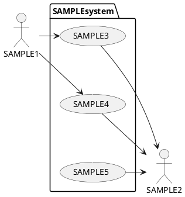
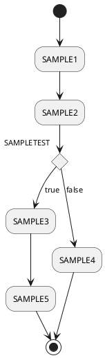

# ソフトウェア機能要求リストフォーマット

## 改訂履歴

---

|頂版|日付|バージョン|改訂内容|備考|
|---:|:---:|:---:|:---:|:---:|
|1|-|-|-|-|
|2|-|-|-|-|
|3|-|-|-|-|
|4|-|-|-|-|
|5|-|-|-|-|

## 機能要求リスト

---

|ソフトウェアで実現可能な機能|関連するハードウェア|プラットフォーム|
|:---:|:---:|:---:|
|SAMPLE|SAMPLE|SAMPLE|
|SAMPLE|SAMPLE|SAMPLE|
||||
||||
||||

|想定される異常事態|対応策|
|:---:|:---:|
|SAMPLE|SAMPLE|
|||
|||
|||

## ユースケース分析

---

### ユースケース・シナリオ

|ユースケース名：|<ユースケース番号記入>|<機能記入>|
|:---|:---:|:---:|
|**概要：**||ー
|**アクター：**||ー
|**事前条件：**||ー
|**事後条件：**||ー
|**機能要求：**||ー
|**メインフロー：**||ー
|**分岐フロー：**||ー
|**例外フロー：**||ー
|**関連ユースケース：**||ー
|**補足資料：**||ー
|**備考：**||ー

### ユースケース図

### アクティビティ図

