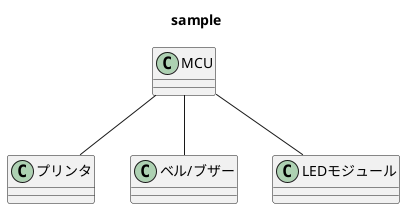
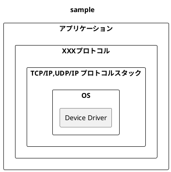
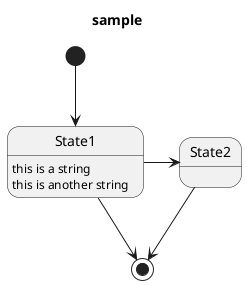

# 2.1.3 ソフトウェア全体の振る舞いの設計

## 改訂履歴

| 項番 | 日付 | バージョン | 改定内容 | 備考 |
| ---- | ---- | ---- | ---- | ----|
| 1 | 7/26 | 1.0 | 作成 |  |
| 2 | 7/27 | 1.1 | 項目の追加 |   |
| 3 |
| 4 |

## 目次

- [2.1.3 ソフトウェア全体の振る舞いの設計](#213-ソフトウェア全体の振る舞いの設計)
  - [改訂履歴](#改訂履歴)
  - [目次](#目次)
  - [1. 概要](#1-概要)
    - [1.1 目的](#11-目的)
    - [1.2 参照ドキュメント](#12-参照ドキュメント)
    - [1.3 定義](#13-定義)
  - [2. システム構成](#2-システム構成)
    - [2.1 システム全体構成](#21-システム全体構成)
      - [2.1.1 システム構成要素の名称/基本機能](#211-システム構成要素の名称基本機能)
  - [3. ソフトウェア構成](#3-ソフトウェア構成)
    - [3.1 ソフトウェア全体構成](#31-ソフトウェア全体構成)
      - [3.1.1 ソフトウェアを構成する機能ユニットの名称/基本機能/動作形態](#311-ソフトウェアを構成する機能ユニットの名称基本機能動作形態)
  - [4. 制御方式](#4-制御方式)
    - [4.1 メモリー構成/レイアウト](#41-メモリー構成レイアウト)
    - [4.2 ソフトウェア制御方式](#42-ソフトウェア制御方式)
    - [4.3 性能見積](#43-性能見積)
  - [5. 機能ユニット詳細](#5-機能ユニット詳細)
    - [5.1 各機能ユニット間の状態定義](#51-各機能ユニット間の状態定義)
    - [5.2 各機能ユニット間の状態遷移](#52-各機能ユニット間の状態遷移)
  - [6. システムで扱うデータ](#6-システムで扱うデータ)
  - [7. 例外一覧](#7-例外一覧)

## 1. 概要　<!-- TODO: 概要を書く -->

ソフトウェア全体の振る舞いを設計する。

### 1.1 目的　　<!--  TODO: 目的を書く -->

### 1.2 参照ドキュメント　<!-- TODO: 参照ドキュメントを書く -->

各ハードウェア仕様書

### 1.3 定義　　　<!-- TODO: 出てくる用語に応じて定義を記載 -->

## 2. システム構成

### 2.1 システム全体構成　<!-- TODO: システム全体構成を振る舞いが分かるようにクラス図で描く -->

#### 2.1.1 システム構成要素の名称/基本機能　<!-- TODO: 表の挿入　項目は名称、基本機能 -->

| 名称 | 基本機能 |
| :----: | :----: |
| -- | -- |
| -- | -- |
| -- | -- |

## 3. ソフトウェア構成

### 3.1 ソフトウェア全体構成　<!-- TODO: ソフトウェア全体構成をクラス図で描く -->

#### 3.1.1 ソフトウェアを構成する機能ユニットの名称/基本機能/動作形態　<!-- TODO: 表の挿入　項目は名称、基本機能、動作形態 -->

| 名称 | 基本機能 | 動作形態 |
| :----: | :----: | :----: |
| - | - | - |
| - | - | - |

## 4. 制御方式

### 4.1 メモリー構成/レイアウト　<!-- TODO: メモリー構成を表で書く -->

### 4.2 ソフトウェア制御方式　<!-- TODO: シーケンス図で描く -->

### 4.3 性能見積 <!-- TODO: 各処理時間見積もり -->
<!-- TODO: メモリ使用量算出表を書く -->

## 5. 機能ユニット詳細 <!-- 構成、機能、入出力、処理方式などを詳細化する -->

### 5.1 各機能ユニット間の状態定義　<!-- TODO: 定義を表で書く -->

| 状態 | 定義 |
| :----: | :----: |
| - | - |

### 5.2 各機能ユニット間の状態遷移　<!-- TODO: 状態遷移図を描く -->

## 6. システムで扱うデータ <!-- TODO: データについて表に記入 -->

| データ名 | データの使用目的 | 更新/参照元 |
| :----: | :----: | :----: |
| -- | -- | -- |
| -- | -- | -- |

## 7. 例外一覧 <!-- TODO: 異常/例外情報を表に記入 -->

| 異常/例外時コード | メッセージ | 意味 | 対策 |
| :----: | :----: | :----: | :----: |
| -- | -- | -- | -- |
| -- | -- | -- | -- |
